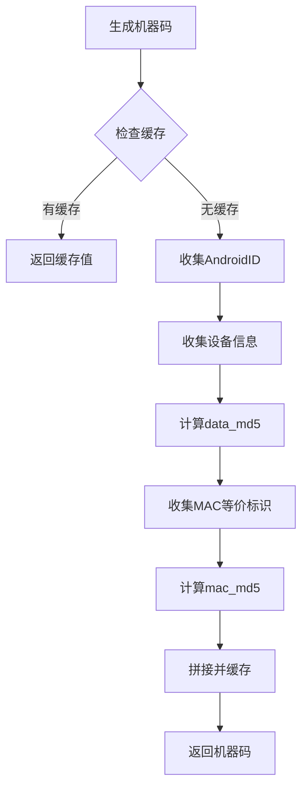

# Android 端机器码生成实现方案

> 本文档描述如何将 Windows 端的机器码生成逻辑移植到 Android 平台

---

## 📋 Windows vs Android 数据源映射

| Windows 注册表 | Android 替代方案 | 获取方式 |
|----------------|------------------|----------|
| `ProductId` | 设备型号 + Build.ID | `Build.MODEL` + `Build.ID` |
| `MachineGuid` | `ANDROID_ID` | `Settings.Secure.ANDROID_ID` |
| `InstallDate` | 应用首次安装时间 | `SharedPreferences` 或 `AppOpsManager` |

---

## 🔧 推荐方案一：AndroidID + OAID 组合

### 核心逻辑

```kotlin
object MachineCodeGenerator {
    
    private const val PREFS_NAME = "ets_machine_config"
    private const val KEY_INSTALL_DATE = "install_date"
    
    /**
     * 生成机器码
     * 格式: data_md5|mac_md5
     */
    fun generate(): String {
        val data = collectDeviceData()
        val macEquivalent = collectMacEquivalent()
        
        val dataMd5 = md5(data).substring(8, 24)
        val macMd5 = md5(macEquivalent).substring(8, 24)
        
        return "$dataMd5|$macMd5"
    }
    
    /**
     * 收集设备数据（替代 ProductId + MachineGuid + InstallDate）
     */
    private fun collectDeviceData(): String {
        val context = AppCompatApplication.getInstance()
        
        // 1. AndroidID (替代 MachineGuid)
        val androidId = Settings.Secure.getString(
            context.contentResolver,
            Settings.Secure.ANDROID_ID
        ) ?: ""
        
        // 2. 设备型号信息 (替代 ProductId)
        val productInfo = "${Build.BOARD}|${Build.BRAND}|${Build.MODEL}|${Build.DEVICE}"
        
        // 3. 安装日期 (替代 InstallDate)
        val installDate = getInstallDate()
        
        return androidId + productInfo + installDate
    }
    
    /**
     * 收集MAC等价标识 (替代 MAC地址)
     */
    private fun collectMacEquivalent(): String {
        // 方案A: WiFi MAC (需要 READ_PHONE_STATE 权限)
        val wifiMac = getWifiMacAddress()
        if (wifiMac.isNotEmpty()) return wifiMac
        
        // 方案B: 获取OAID (需要移动安全联盟SDK)
        val oaid = getOAID()
        if (oaid.isNotEmpty()) return oaid
        
        // 方案C: 使用 ANDROID_ID + 随机数合成
        return generateFallbackId()
    }
}
```

---

## 📦 依赖配置

### build.gradle

```groovy
dependencies {
    // MD5计算
    implementation 'org.jetbrains.kotlin:kotlin-stdlib:1.9.0'
    
    // 如果使用OAID需要引入移动安全联盟SDK
    // implementation 'com.bun.miit:oaid_sdk:1.0.23'
}
```

### AndroidManifest.xml

```xml
<!-- WiFi MAC 获取权限 -->
<uses-permission android:name="android.permission.ACCESS_WIFI_STATE" />
<uses-permission android:name="android.permission.READ_PHONE_STATE" />

<!-- 网络权限 -->
<uses-permission android:name="android.permission.INTERNET" />
```

---

## 🛠️ 完整实现代码

### MachineCodeGenerator.kt

```kotlin
package com.etscracker.hwid

import android.annotation.SuppressLint
import android.content.Context
import android.content.SharedPreferences
import android.net.wifi.WifiManager
import android.os.Build
import android.provider.Settings
import java.security.MessageDigest

object MachineCodeGenerator {
    
    private const val PREFS_NAME = "ets_hwid_cache"
    private const val KEY_DATA_MD5 = "data_md5"
    private const val KEY_MAC_MD5 = "mac_md5"
    private const val KEY_INSTALL_DATE = "first_install_time"
    
    /**
     * 生成机器码
     * 格式: {data_md5(16)}|{mac_md5(16)}
     */
    fun generate(context: Context): String {
        val data = collectDeviceData(context)
        val macEquivalent = collectMacEquivalent(context)
        
        val dataMd5 = md5(data).substring(8, 24)
        val macMd5 = md5(macEquivalent).substring(8, 24)
        
        // 缓存机器码
        cacheMachineCode(context, dataMd5, macMd5)
        
        return "$dataMd5|$macMd5"
    }
    
    /**
     * 收集设备数据
     */
    private fun collectDeviceData(context: Context): String {
        val sb = StringBuilder()
        
        // 1. AndroidID (MachineGuid替代)
        @SuppressLint("HardwareIds")
        val androidId = Settings.Secure.getString(
            context.contentResolver,
            Settings.Secure.ANDROID_ID
        ) ?: ""
        sb.append(androidId)
        
        // 2. 设备信息 (ProductId替代)
        sb.append(Build.BOARD)      // 主板
        sb.append(Build.BRAND)      // 品牌
        sb.append(Build.MODEL)      // 型号
        sb.append(Build.DEVICE)     // 设备名
        
        // 3. 安装日期 (InstallDate替代)
        sb.append(getFirstInstallTime(context))
        
        return sb.toString()
    }
    
    /**
     * 收集MAC等价标识
     */
    @SuppressLint("HardwareIds")
    private fun collectMacEquivalent(context: Context): String {
        // 方案1: WiFi MAC
        try {
            val wifiManager = context.applicationContext.getSystemService(Context.WIFI_SERVICE) as WifiManager
            val wifiInfo = wifiManager.connectionInfo
            val mac = wifiInfo?.macAddress
            if (!mac.isNullOrEmpty() && mac != "02:00:00:00:00:00") {
                return mac.replace(":", "").uppercase()
            }
        } catch (e: Exception) {
            // 忽略
        }
        
        // 方案2: 使用 ANDROID_ID + Build.SERIAL 合成
        val androidId = Settings.Secure.getString(
            context.contentResolver,
            Settings.Secure.ANDROID_ID
        ) ?: ""
        
        @Suppress("DEPRECATION")
        val serial = Build.SERIAL ?: "UNKNOWN"
        
        return androidId + serial
    }
    
    /**
     * 获取首次安装时间
     */
    private fun getFirstInstallTime(context: Context): Long {
        val prefs = context.getSharedPreferences(PREFS_NAME, Context.MODE_PRIVATE)
        
        var installTime = prefs.getLong(KEY_INSTALL_DATE, 0)
        
        if (installTime == 0L) {
            // 首次运行，记录当前时间
            installTime = System.currentTimeMillis()
            prefs.edit().putLong(KEY_INSTALL_DATE, installTime).apply()
        }
        
        return installTime
    }
    
    /**
     * 计算MD5
     */
    private fun md5(input: String): String {
        val md = MessageDigest.getInstance("MD5")
        val digest = md.digest(input.toByteArray(Charsets.UTF_8))
        return digest.joinToString("") { "%02x".format(it) }.uppercase()
    }
    
    /**
     * 缓存机器码
     */
    private fun cacheMachineCode(context: Context, dataMd5: String, macMd5: String) {
        context.getSharedPreferences(PREFS_NAME, Context.MODE_PRIVATE)
            .edit()
            .putString(KEY_DATA_MD5, dataMd5)
            .putString(KEY_MAC_MD5, macMd5)
            .apply()
    }
}
```

---

## 📊 方案对比

| 方案 | 优点 | 缺点 |
|------|------|------|
| **WiFi MAC** | 稳定、不变 | 需要权限、Android 6.0+ 可能拿不到 |
| **OAID** | 符合监管、隐私安全 | 需要额外SDK |
| **AndroidID + Serial** | 无需权限 | Serial 在部分设备需要申请 |

---

## 🎯 推荐实现流程



---

## ⚠️ 注意事项

1. **Android 6.0+ MAC获取限制**
   - WiFi MAC 在 Android 6.0+ 无法直接获取
   - 推荐使用 **OAID** 或 **AndroidID + Serial** 组合

2. **隐私合规**
   - Google Play 上架建议使用 `AdvertiserId` (需用户授权)
   - 国内市场可使用 **OAID** (移动安全联盟方案)

3. **兼容性测试**
   - 华为/小米/OPPO/vivo 等厂商可能有特殊限制
   - 建议准备 fallback 方案

---

## 📱 调用示例

```kotlin
// Activity 或 Application 中调用
val machineCode = MachineCodeGenerator.generate(context)
Log.d("MachineCode", machineCode)
// 输出示例: 8A3F5C2E1B4D6F09|A1B2C3D4E5F60718
```

---

*文档版本: 1.0*
*目标平台: Android (Kotlin)*