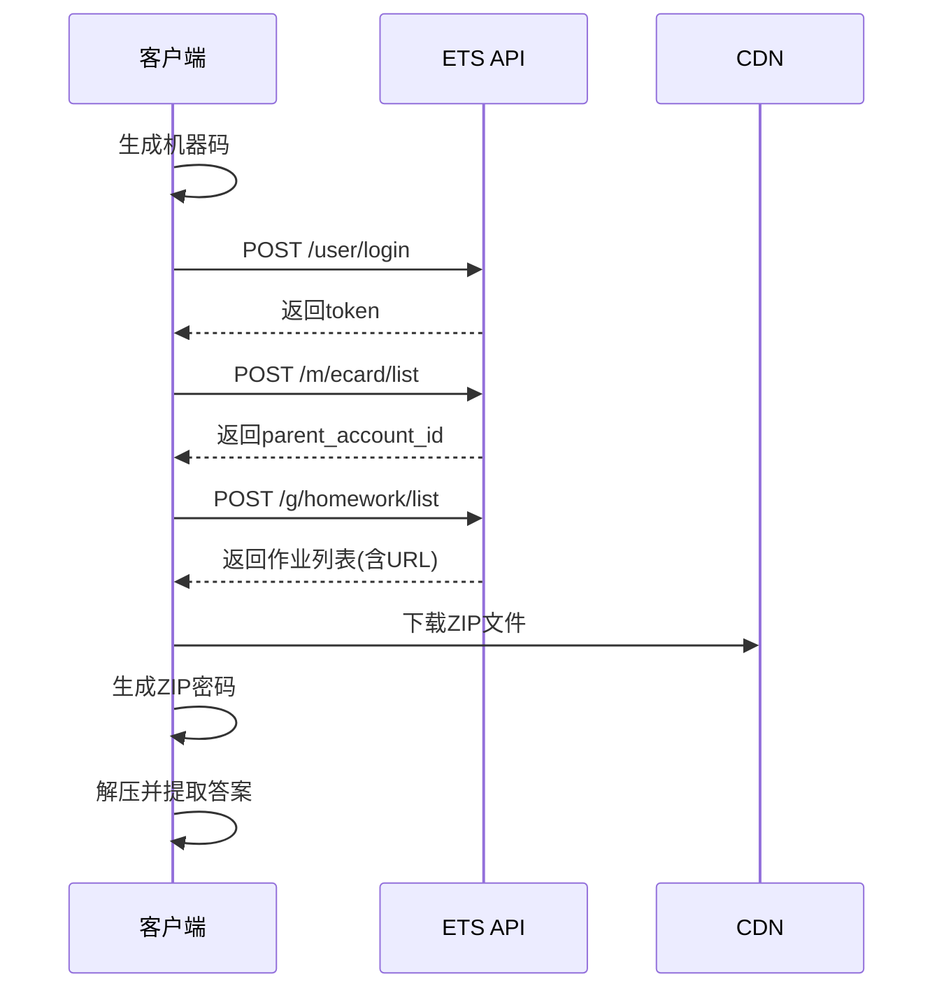

# ETS100 API 开发文档

> 本文档描述 ETS100 教育平台 API 的完整逻辑，供开发者重新实现客户端。

---

## 📌 全局配置

```python
API_BASE_URL = "https://api.ets100.com"
CDN_BASE_URL = "https://cdn.subject.ets100.com"
PID = "grlx"
SECRET_KEY = "555ffbe95ccf4e9535a110170b445ab8"
FOOTER_SIZE = 336
```

---

## 🔐 请求签名算法

### 签名生成流程

```
sign_string = PID + timestamp + content + SECRET_KEY
signature = MD5(sign_string).hexdigest()
```

| 参数 | 说明 |
|------|------|
| `PID` | 固定值 `"grlx"` |
| `timestamp` | Unix时间戳（秒），`int(time.time())` |
| `content` | 请求体的Base64编码 |
| `SECRET_KEY` | 固定值 `"555ffbe95ccf4e9535a110170b445ab8"` |

---

## 📦 请求格式

### HTTP 请求头

```
Host: api.ets100.com
User-Agent: libcurl-agent/1.0
Content-Type: application/x-www-form-urlencoded
Accept: */*
```

### 请求体结构

```json
{
    "body": "base64(body_data)",
    "head": {
        "version": "1.0",
        "sign": "md5_signature",
        "pid": "grlx",
        "time": 1234567890
    }
}
```

### body_data 格式

```json
[
    {
        "r": "api_endpoint_path",
        "params": {
            "sn": "test",
            "token": "...",
            ...其他参数
        }
    }
]
```

---

## 🔑 API 端点详解

### 1. 用户登录

**端点：** `POST /user/login`

**请求参数：**

| 参数 | 类型 | 说明 |
|------|------|------|
| `sn` | string | 设备序列号，默认 `"test"` |
| `phone` | string | 手机号 |
| `password` | string | 密码（明文） |
| `device_code` | string | 机器码，见下方生成算法 |
| `device_name` | string | 计算机名 `os.environ['COMPUTERNAME']` |
| `version` | string | 版本号，默认 `"3"` |
| `local_ip` | string | 本地IP，默认 `"127.0.0.1"` |
| `system` | string | 系统标识，默认 `"4"` |
| `global_client_version` | string | 全局客户端版本 |
| `sign_response` | int | 签名响应，默认 `1` |

**响应数据：**

```json
{
    "body": {
        "token": "xxxxxxxxxxxx"
    }
}
```

---

### 2. 获取父账户ID

**端点：** `POST /m/ecard/list`

**请求参数：**

| 参数 | 类型 | 说明 |
|------|------|------|
| `sn` | string | 设备序列号 |
| `token` | string | 登录返回的token |
| `version` | string | 版本号，默认 `"2"` |
| `system` | string | 系统标识，默认 `"4"` |
| `global_client_version` | string | 全局客户端版本 |
| `sign_response` | int | 签名响应，默认 `1` |

**响应数据：**

```json
{
    "body": {
        "0": {
            "parent_id": "123456"
        }
    }
}
```

---

### 3. 获取作业列表

**端点：** `POST /g/homework/list`

**请求参数：**

| 参数 | 类型 | 说明 |
|------|------|------|
| `sn` | string | 设备序列号 |
| `token` | string | 登录返回的token |
| `parent_account_id` | string | 父账户ID |
| `limit` | string | 限制数量，默认 `"0"` 表示全部 |
| `status` | string | 作业状态，默认 `"1"` |
| `offset` | string | 偏移量，默认 `"0"` |
| `get_to_do_count` | int | 是否获取待完成数量，默认 `1` |
| `show_old_homework` | int | 是否显示旧作业，默认 `1` |
| `get_all_count` | int | 是否获取总数，默认 `1` |
| `check_pass` | int | 默认 `1` |
| `get_to_overtime_count` | int | 默认 `1` |
| `version` | string | 版本号 |
| `system` | string | 系统标识 |
| `global_client_version` | string | 全局客户端版本 |
| `sign_response` | int | 签名响应 |

**响应数据：**

```json
{
    "body": {
        "base_url": "https://cdn.subject.ets100.com",
        "data": [
            {
                "name": "作业名称",
                "struct": {
                    "contents": [
                        {
                            "group_name": "题型名称",
                            "url": "/path/to/file.zip"
                        }
                    ]
                }
            }
        ]
    }
}
```

---

## 📁 文件解压逻辑

### ZIP 密码生成算法

```python
def generate_zip_password(zip_data: bytes) -> str:
    """
    从ZIP文件数据生成解压密码
    """
    FOOTER_SIZE = 336
    
    # 1. 提取尾部336字节
    footer = zip_data[-FOOTER_SIZE:]
    
    # 2. 验证文件签名
    #    签名位置1: footer[0:8] == b'MSTCHINA'
    #    签名位置2: footer[144:149] == b'EPLAT'
    if not (footer[:8] == b'MSTCHINA' or footer[144:149] == b'EPLAT'):
        raise ValueError("无效的文件签名")
    
    # 3. 提取128字节种子数据 (偏移16-143)
    seed = footer[16:144]
    
    # 4. 第一次MD5
    first_md5 = hashlib.md5(seed).digest()
    first_hex = first_md5.hex().upper()  # 32字符
    
    # 5. 第二次MD5
    second_md5 = hashlib.md5(first_hex.encode('ascii')).digest()
    second_hex = second_md5.hex().upper()  # 32字符
    
    # 6. 拼接最终密码 (64字符)
    return first_hex + second_hex
```

### 密码格式示意

```
[种子数据 128字节] → MD5 → [32字符hex] → MD5 → [32字符hex]
                                      ↓
                              拼接 = 64字符密码
```

---

## 📝 答案提取逻辑

### 题型分类

| 题型 | 文件 | 提取方式 |
|------|------|----------|
| 听后选择 | `info.json` | 解析 `code_json_array` 字段的 `answer` |
| 听后回答 | `content.json` | 解析 `info.question` 的 `std[n].value` |
| 听后转述 | `content.json` | 解析 `info.std[n].value`，去除 `<i></i>` 标签 |
| 短文朗读 | `content.json` | 解析 `info.value`，去除 `<p></p>` 标签 |

### 听后选择答案提取

```python
def extract_listen_choice_answer(extract_dir: str) -> str:
    with open(f"{extract_dir}/info.json", "r", encoding="utf-8") as f:
        data = json.load(f)
        code_json_array = json.loads(data[1]["code_json_array"])
        
        answers = ""
        for item in code_json_array:
            answers += item["answer"]
        return answers
```

### 听后回答答案提取

```python
def extract_listen_answer_answer(extract_dir: str) -> str:
    with open(f"{extract_dir}/content.json", "r", encoding="utf-8") as f:
        data = json.load(f)
        questions = data["info"]["question"]
        
        answers = ""
        for item in questions:
            answer1 = item["std"][0]["value"].replace("</br>", "")
            answer2 = item["std"][1]["value"].replace("</br>", "") if len(item["std"]) > 1 else ""
            answer3 = item["std"][2]["value"].replace("</br>", "") if len(item["std"]) > 2 else ""
            keywords = item.get("keywords", "")
            
            answers += f"(1):{answer1}\n(2):{answer2}\n(3):{answer3}\n关键词:{keywords}\n"
        return answers
```

### 听后转述答案提取

```python
def extract_listen_retell_answer(extract_dir: str) -> str:
    with open(f"{extract_dir}/content.json", "r", encoding="utf-8") as f:
        data = json.load(f)
        info = data["info"]
        
        answers = ""
        for i in range(3):
            try:
                answer = info["std"][i]["value"].replace("<i>", "").replace("</i>", "")
                answers += f"({i+1}):{answer}\n\n"
            except (IndexError, KeyError):
                break
        return answers
```

### 短文朗读答案提取

```python
def extract_read_aloud_answer(extract_dir: str) -> str:
    with open(f"{extract_dir}/content.json", "r", encoding="utf-8") as f:
        data = json.load(f)
        return data["info"]["value"].replace("<p>", "").replace("</p>", "")
```

---

## 🔧 机器码生成算法

见 [hwid.py](hwid.py) 或 [机器码.py](机器码.py)

```python
def generate_machine_code() -> str:
    # 1. 读取注册表值
    data = ""
    data += read_registry("HKLM", "SOFTWARE\\Microsoft\\Windows NT\\CurrentVersion", "ProductId")
    data += read_registry("HKLM", "SOFTWARE\\Microsoft\\Cryptography", "MachineGuid")
    data += read_registry("HKLM", "SOFTWARE\\ETSKey", "InstallDate")
    
    # 2. 获取MAC地址
    mac_address = get_mac_address()  # 排除回环和虚拟网卡
    
    # 3. 计算MD5
    data_md5 = hashlib.md5(data.encode('utf-8')).hexdigest().upper()[8:24]
    mac_md5 = hashlib.md5(mac_address.encode('utf-8')).hexdigest().upper()[8:24]
    
    # 4. 格式: data_md5|mac_md5
    return f"{data_md5}|{mac_md5}"
```

---

## 🔄 完整工作流程



---

## 📋 开发清单

- [ ] 实现签名生成算法
- [ ] 实现登录接口
- [ ] 实现获取父账户ID接口
- [ ] 实现获取作业列表接口
- [ ] 实现机器码生成
- [ ] 实现ZIP密码生成
- [ ] 实现答案文件解析

---

*文档版本：1.0*
*基于 release.py 分析生成*